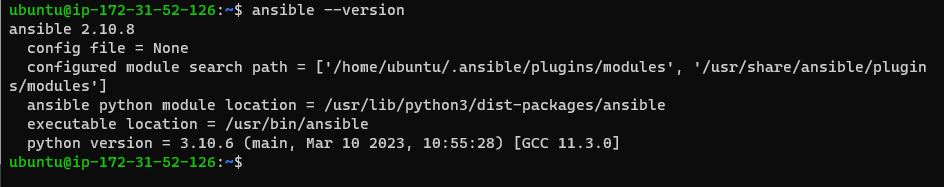
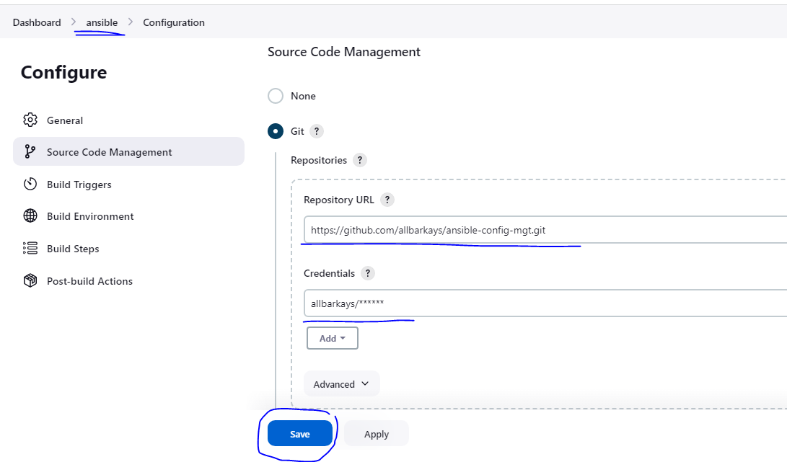
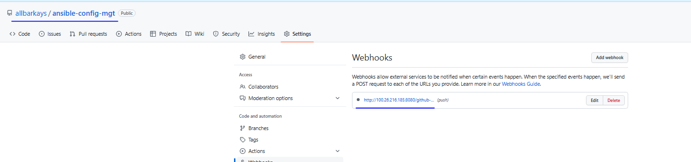
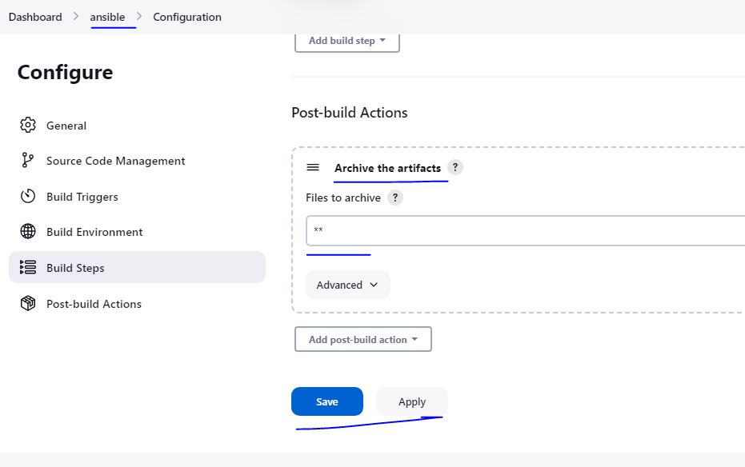
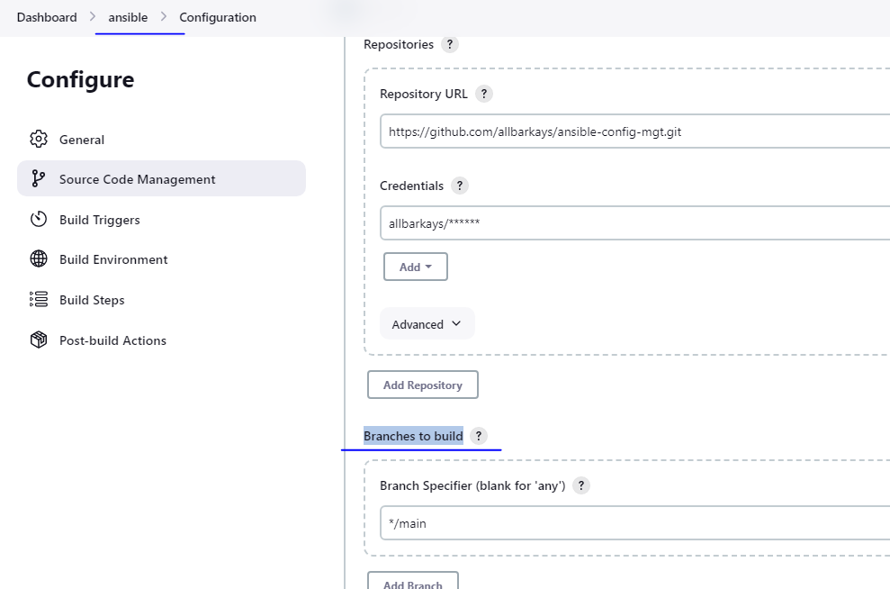
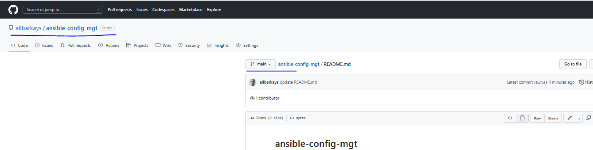
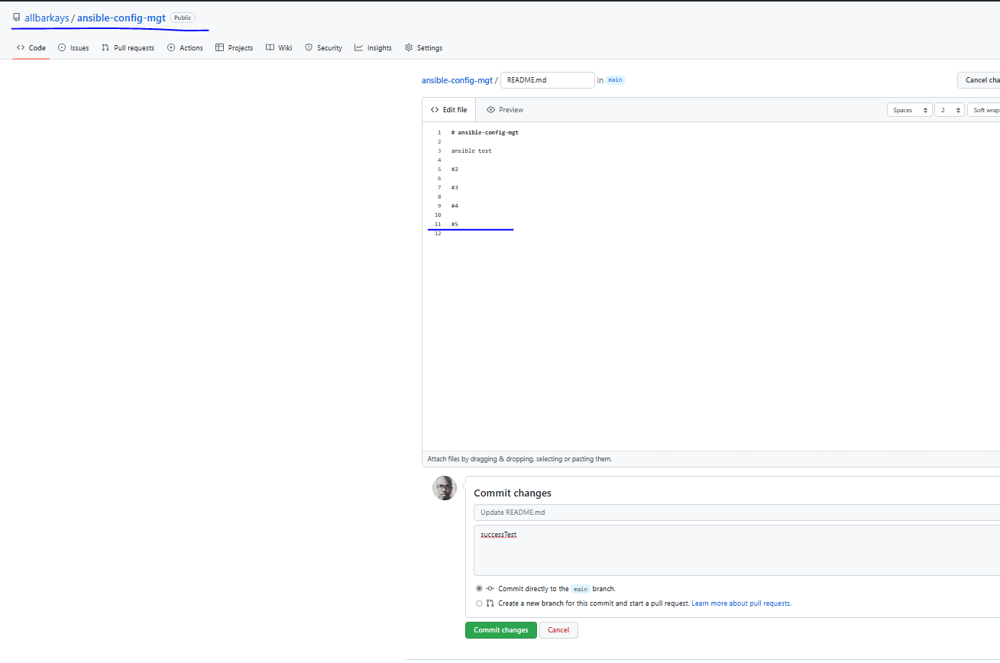
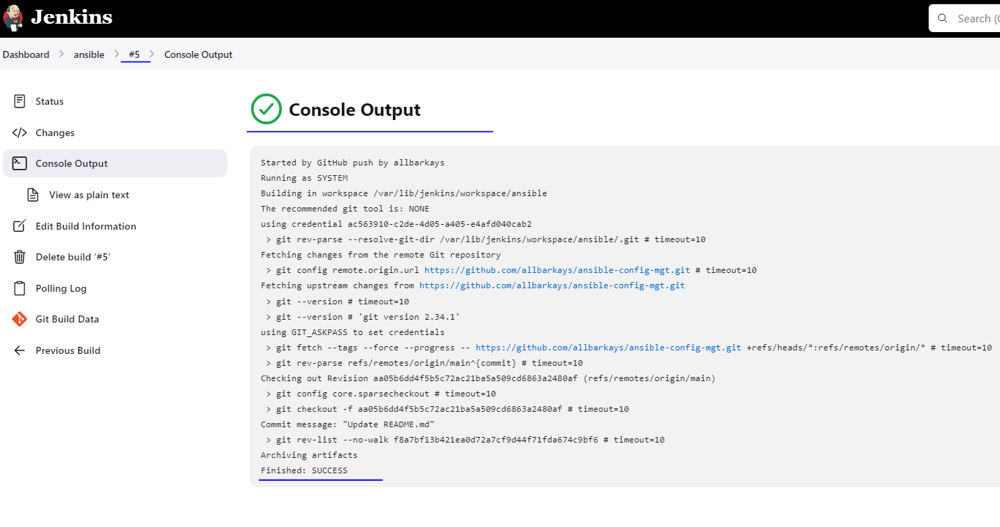
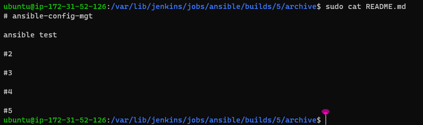
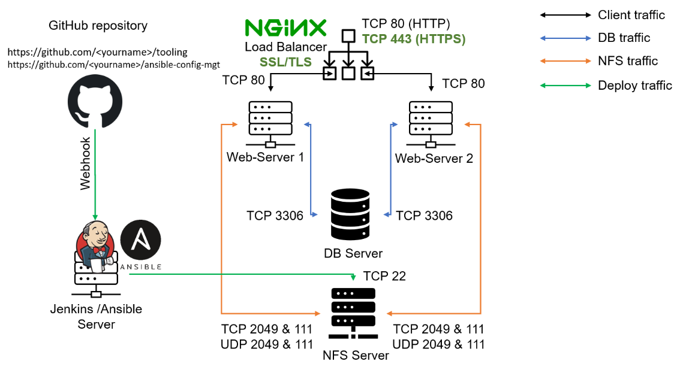

# ANSIBLE CONFIGURATION MANAGEMENT – AUTOMATE PROJECT 7 TO 10

## Project task:
1. Install and configure Ansible client to act as a Jump Server/Bastion Host
2. Create a simple Ansible playbook to automate servers configuration


## INSTALL AND CONFIGURE ANSIBLE ON EC2 INSTANCE
1. Installed ***ansible*** on EC2 server previously used as Jenkins server in project 9 and checked the version:

```
sudo apt update

sudo apt install ansible

ansible --version
```





2. I created a new repository named ***ansible-config-mgt***
3. Configure Jenkins build job to save the repository content every time it is changed – (just as in Project 9)

* Create a new Freestyle project ansible in Jenkins and point it to your ‘ansible-config-mgt’ repository.




* Configure Webhook in GitHub and set webhook to trigger ansible build.




* Configure a Post-build job to save all (**) files, like you did it in Project 9.





* The **build** failed a couple of times until I matched the ***Branches to build*** to the one in the repository which is main from master in the configuration settings as below:

***Note: Trigger Jenkins project execution only for /main (master) branch.***














5. Test your setup by making some change in README.MD file in master branch and make sure that builds starts automatically and Jenkins saves the files (build artifacts) in following folder





**Now our architecture looks like:**





## Step 2 – Prepare your development environment using Visual Studio Code

1. Install VSCode

2. Then connect to the newly created GitHub repository.

3. Clone down your ***ansible-config-mgt*** repo to the Jenkins-Ansible instance
`git clone https://github.com/allbarkays/ansible-config-mgt.git`


