# ANSIBLE CONFIGURATION MANAGEMENT – AUTOMATE PROJECT 7 TO 10

## Project task:
1. Install and configure Ansible client to act as a Jump Server/Bastion Host
2. Create a simple Ansible playbook to automate servers configuration


## INSTALL AND CONFIGURE ANSIBLE ON EC2 INSTANCE
1. Installed ***ansible*** on EC2 server previously used as Jenkins server in project 9 and checked the version:

```
sudo apt update

sudo apt install ansible

ansible --version
```


2. I created a new repository named ***ansible-config-mgt***
3. Configure Jenkins build job to save the repository content every time it is changed – (just as in Project 9)

* Create a new Freestyle project ansible in Jenkins and point it to your ‘ansible-config-mgt’ repository.


* Configure Webhook in GitHub and set webhook to trigger ansible build.


* Configure a Post-build job to save all (**) files, like you did it in Project 9.


* The **build** failed a couple of times until I matched the ***Branches to build*** to the one in the repository which is main from master in the configuration settings as below:

***Note: Trigger Jenkins project execution only for /main (master) branch.***


5. Test your setup by making some change in README.MD file in master branch and make sure that builds starts automatically and Jenkins saves the files (build artifacts) in following folder


**Now our architecture looks like:**


## Step 2 – Prepare your development environment using Visual Studio Code

<<<<<<< HEAD
1. Install VSCode which will be used to write and edit codes.
=======
1. Install VSCode
>>>>>>> 19c112de8bf55609c04e443136c4c970d24aa1db

2. Then connect to the newly created GitHub repository.

3. Clone down your ***ansible-config-mgt*** repo to the Jenkins-Ansible instance
`git clone https://github.com/allbarkays/ansible-config-mgt.git`


<<<<<<< HEAD
### Ansible Configuration
Clone ansible-config-mgt repo on local machine and create a new branch for development


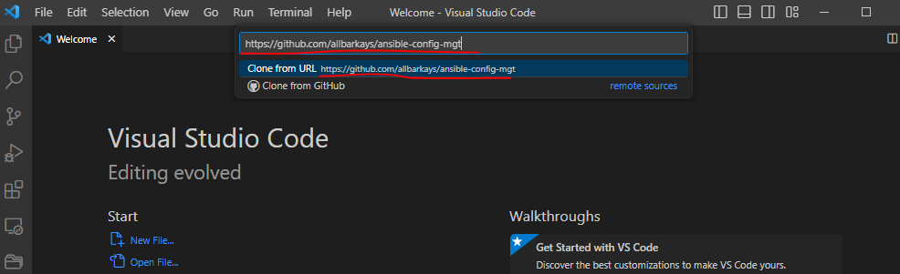


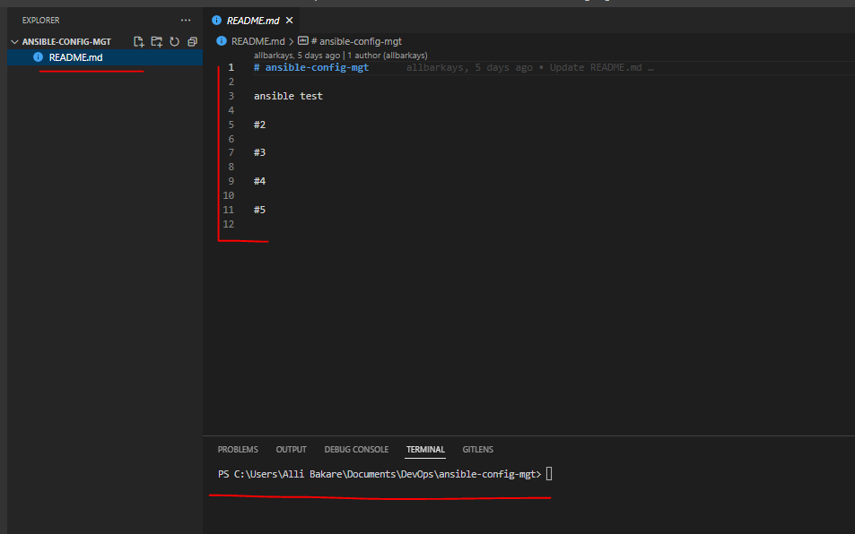


### BEGIN ANSIBLE DEVELOPMENT
1. In the ***ansible-config-mgt*** GitHub repository, create a new branch that will be used for development by first using `git branch` to confirm my current branch

Then, using `git checkout -b ansible-prj11` to create a new branch ***ansible-prj11*** and switch to the branch

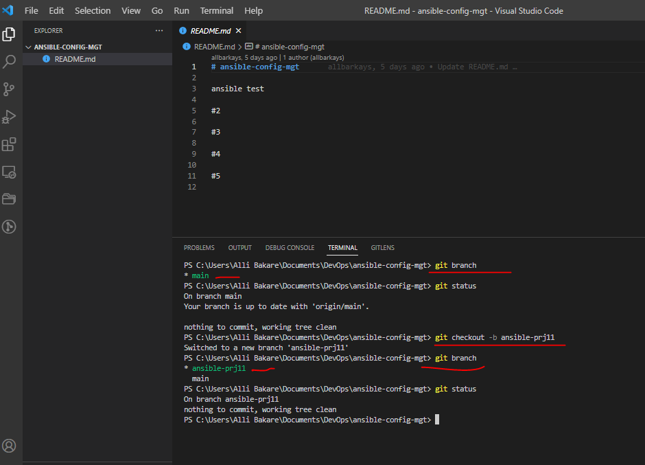


2. Checkout the newly created feature branch to your local machine and start building your code and directory structure
3. Create a directory and name it `playbooks` – it will be used to store all the playbook files.

`mkdir playbooks`

4. Create a directory and name it `inventory` – it will be used to keep your hosts organised.

`mkdir inventory`

5. Within the playbooks folder, create your first playbook, and name it `common.yml`

`touch common.yml`

6. Within the inventory folder, create an inventory file `(.yml)` for each environment (Development, Staging Testing and Production) dev, staging, uat, and prod respectively.

`touch dev.yml staging.yml uat.yml prod.yml`


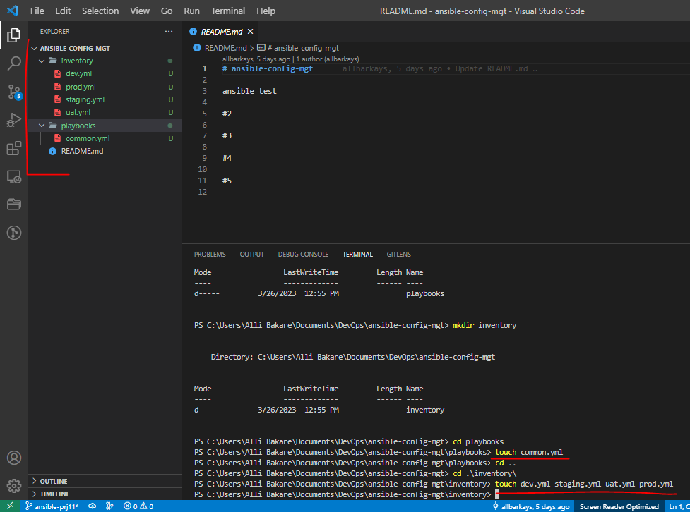


## Setting Up Inventory

* Update your `inventory/dev.yml` file with this snippet of code:

```
[nfs]
<NFS-Server-Private-IP-Address> ansible_ssh_user='ec2-user'

[webservers]
<Web-Server1-Private-IP-Address> ansible_ssh_user='ec2-user'
<Web-Server2-Private-IP-Address> ansible_ssh_user='ec2-user'

[db]
<Database-Private-IP-Address> ansible_ssh_user='ubuntu' 

[lb]
<Load-Balancer-Private-IP-Address> ansible_ssh_user='ubuntu'
```

## Setup SSH agent and connect VS Code to the Jenkins-Ansible instance:

* Note: Ansible uses TCP port 22 by default, which means it needs to ssh into target servers from Jenkins-Ansible host – for this we can implement the concept of ***ssh-agent***. Now we need to import the key into ssh-agent:


```
eval `ssh-agent -s`
ssh-add <path-to-private-key>
```


Now confirm the key has been added with the command below, you should see the name of your key

`ssh-add -l`

Now, ssh into your Jenkins-Ansible server using `ssh-agent`


`ssh -A ubuntu@public-ip`


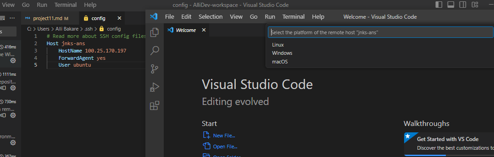


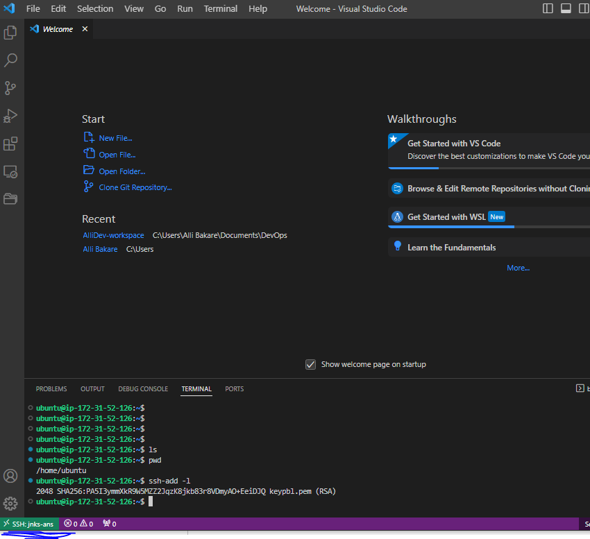


## Creating a Common Playbook

Update the following code in `/playbooks/common.yaml`

```
 ---
- name: update web and nfs servers
  hosts: webservers, nfs
  remote_user: ec2-user
  become: yes
  become_user: root
  tasks:
    - name: ensure wireshark is at the latest version
      yum:
        name: wireshark
        state: latest

- name: update LB abd DB server
  hosts: lb, db
  remote_user: ubuntu
  become: yes
  become_user: root
  tasks:
    - name: Update apt repo
      apt: 
        update_cache: yes

    - name: ensure wireshark is at the latest version
      apt:
        name: wireshark
        state: latest
```


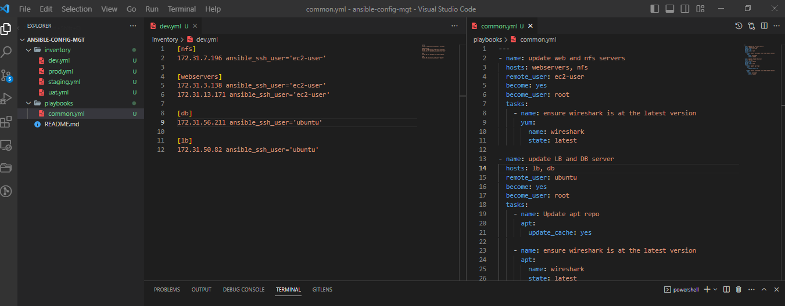


Now all of the directories and files live on the local machine and we need to push changes made locally with the following git commands to add, commit and push the branch to GitHub.

```
git status

git add .

git commit -m "commit message"
```


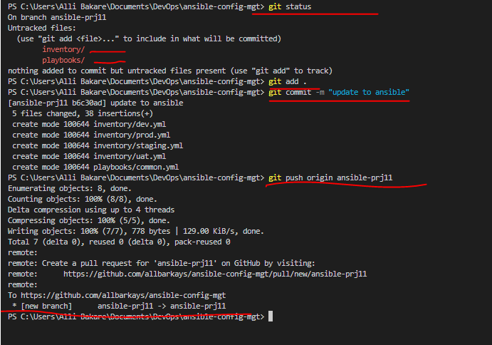


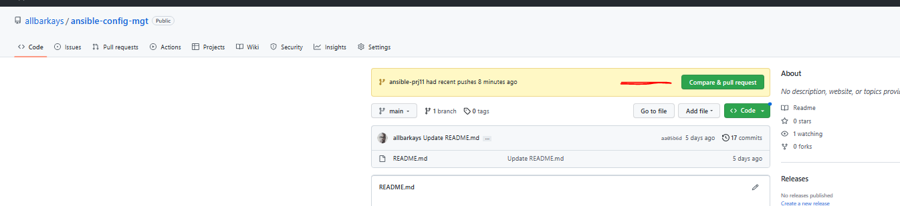


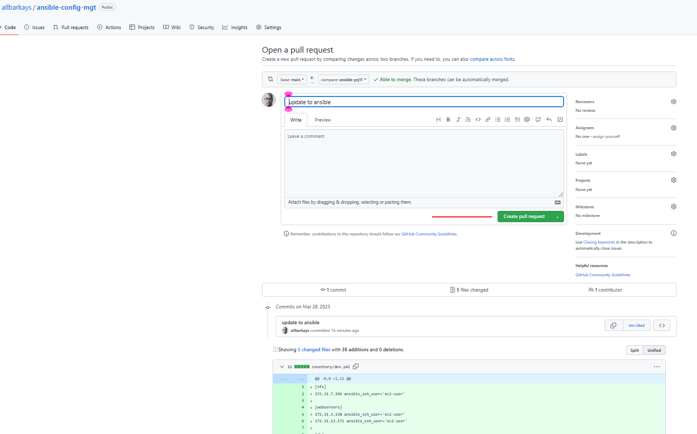


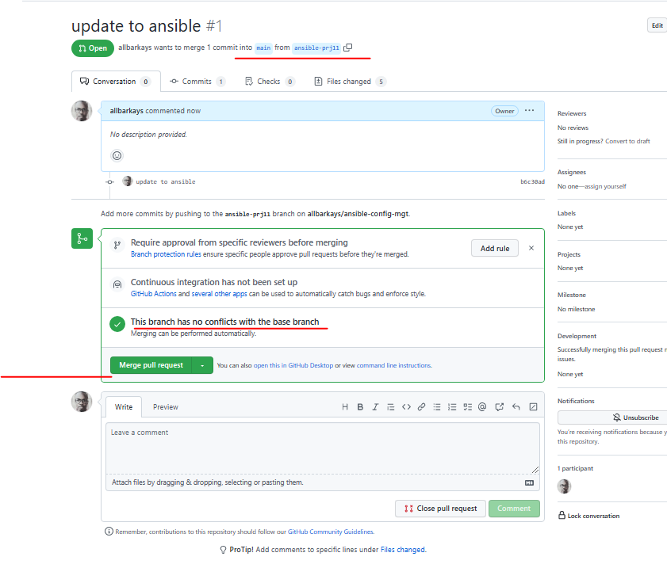


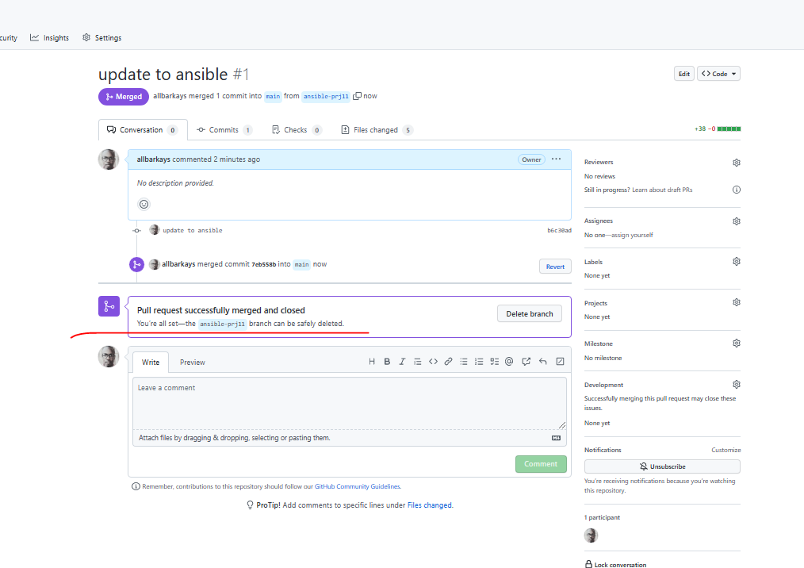


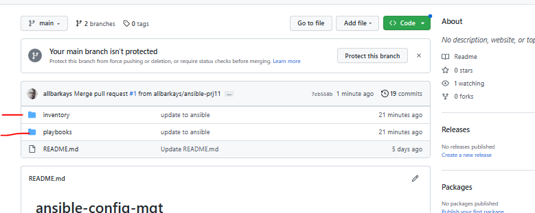


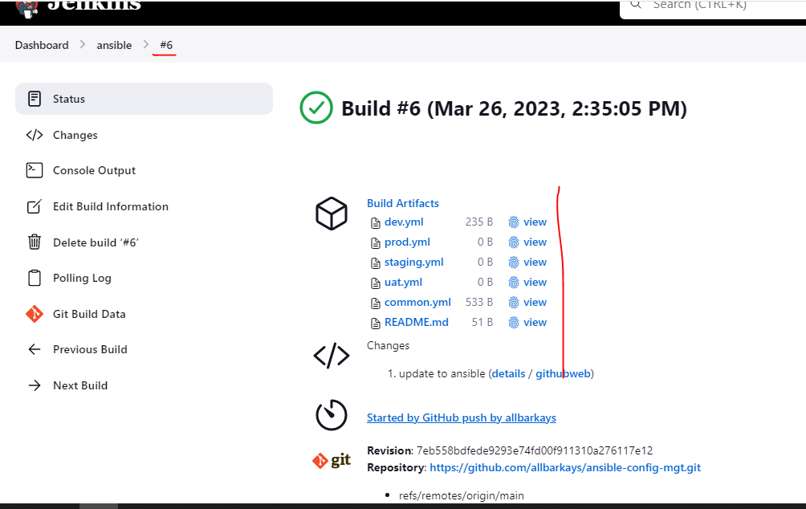


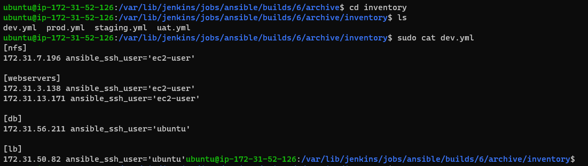


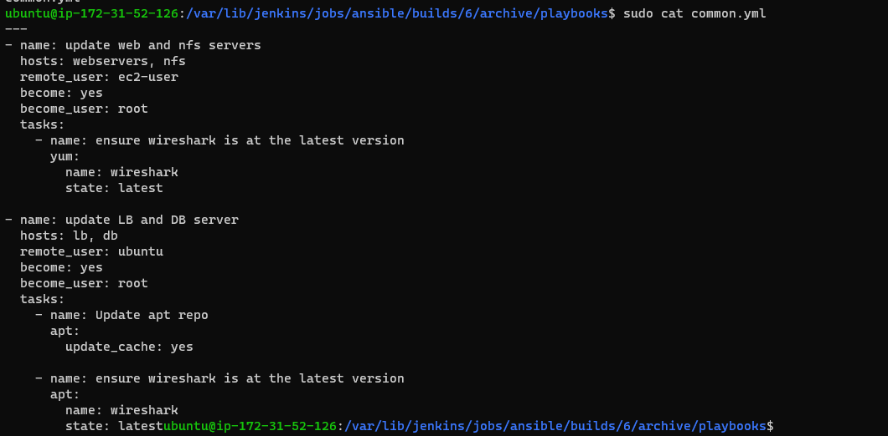


## Run first ansible test
```
ansible-playbook -i /var/lib/jenkins/jobs/ansible/builds/<build-number>/archive/inventory/dev.yml /var/lib/jenkins/jobs/ansible/builds/<build-number>/archive/playbooks/common.yml
```


In my case, I used:

```
ansible-playbook -i /var/lib/jenkins/jobs/ansible/builds/6/archive/inventory/dev.yml /var/lib/jenkins/jobs/ansible/builds/6/archive/playbooks/common.yml
```

At the end of this project we have implemented a solution that is shown below:


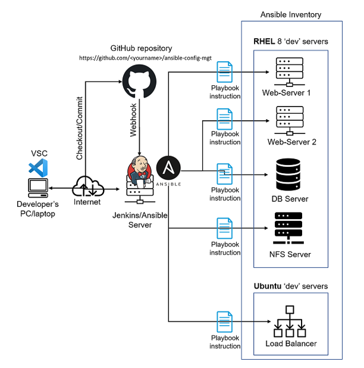


=======
>>>>>>> 19c112de8bf55609c04e443136c4c970d24aa1db


end 11


